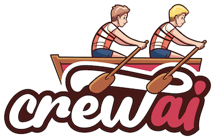

<div align="center">



# **crewAI**

🤖 **crewAI**：用于协调角色扮演和自主AI代理的尖端框架。通过促进协作智能，CrewAI使代理能够无缝协作，解决复杂任务。

<h3>

[主页](https://www.crewai.io/) | [文档](https://docs.crewai.com/) | [与文档聊天](https://chatg.pt/DWjSBZn) | [示例](https://github.com/joaomdmoura/crewai-examples) | [Discord](https://discord.com/invite/X4JWnZnxPb)

</h3>

[](https://github.com/joaomdmoura/crewAI)
[](https://opensource.org/licenses/MIT)

</div>

## 目录

- [为什么选择 CrewAI？](#why-crewai)
- [开始使用](#getting-started)
- [主要功能](#key-features)
- [示例](#examples)
  - [快速教程](#quick-tutorial)
  - [撰写职位描述](#write-job-descriptions)
  - [行程规划](#trip-planner)
  - [股票分析](#stock-analysis)
- [将您的团队连接到模型](#connecting-your-crew-to-a-model)
- [CrewAI 的比较](#how-crewai-compares)
- [贡献](#contribution)
- [遥测](#telemetry)
- [许可证](#license)

## 为什么选择 CrewAI？

AI 协作的力量有太多可以提供的东西。  
CrewAI 的设计旨在使 AI 代理能够承担角色、共享目标，并在一个紧密合作的单位中运作——就像一个运转良好的团队。无论您是在构建智能助手平台、自动化客户服务团队，还是多代理研究团队，CrewAI 都为复杂的多代理交互提供了基础。

## 开始使用

要开始使用 CrewAI，请按照以下简单步骤操作：

### 1. 安装

```shell
pip install crewai
```

如果您想安装 'crewai' 包及其可选功能（包括用于代理的附加工具），可以使用以下命令：pip install 'crewai[tools]'。此命令安装基本包，并添加额外组件，这些组件需要更多的依赖项才能正常工作。

```shell
pip install 'crewai[tools]'
```

### 2. 设置您的团队

```python
import os
from crewai import Agent, Task, Crew, Process
from crewai_tools import SerperDevTool

os.environ["OPENAI_API_KEY"] = "YOUR_API_KEY"
os.environ["SERPER_API_KEY"] = "Your Key" # serper.dev API key

# 您可以选择通过Ollama使用本地模型。例如，更多信息请参见 https://docs.crewai.com/how-to/LLM-Connections/。

# os.environ["OPENAI_API_BASE"] = 'http://localhost:11434/v1'
# os.environ["OPENAI_MODEL_NAME"] ='openhermes'  # 根据可用模型进行调整
# os.environ["OPENAI_API_KEY"] ='sk-111111111111111111111111111111111111111111111111'

# 您可以传递一个可选的llm属性，指定您想要使用的模型。
# 它可以是通过Ollama / LM Studio的本地模型或
# 像OpenAI、Mistral、Antrophic等的远程模型（https://docs.crewai.com/how-to/LLM-Connections/）
#
# import os
# os.environ['OPENAI_MODEL_NAME'] = 'gpt-3.5-turbo'
#
# 或
#
# from langchain_openai import ChatOpenAI

search_tool = SerperDevTool()

# 定义您的代理及其角色和目标
researcher = Agent(
  role='高级研究分析师',
  goal='揭示AI和数据科学的前沿发展',
  backstory="""您在一家领先的科技智库工作。
  您的专长在于识别新兴趋势。
  您擅长剖析复杂数据并提供可行的见解。""",
  verbose=True,
  allow_delegation=False,
  # 您可以传递一个可选的llm属性，指定您想要使用的模型。
  # llm=ChatOpenAI(model_name="gpt-3.5", temperature=0.7),
  tools=[search_tool]
)
writer = Agent(
  role='技术内容策略师',
  goal='撰写引人入胜的科技进展内容',
  backstory="""您是一位著名的内容策略师，以深刻且引人入胜的文章而闻名。
  您将复杂概念转化为引人注目的叙述。""",
  verbose=True,
  allow_delegation=True
)

# 为您的代理创建任务
task1 = Task(
  description="""对2024年AI的最新进展进行全面分析。
  确定关键趋势、突破性技术和潜在行业影响。""",
  expected_output="完整的分析报告，以要点形式呈现",
  agent=researcher
)

task2 = Task(
  description="""根据提供的见解，撰写一篇引人入胜的博客
  文章，突出最重要的AI进展。
  您的文章应信息丰富且易于理解，适合科技爱好者。
  让它听起来酷一些，避免复杂的词汇，以免听起来像AI写的。""",
  expected_output="至少4段的完整博客文章",
  agent=writer
)

# 使用顺序过程实例化您的团队
crew = Crew(
  agents=[researcher, writer],
  tasks=[task1, task2],
  verbose=2, # 您可以将其设置为1或2以选择不同的日志级别
  process = Process.sequential
)

# 让您的团队开始工作！
result = crew.kickoff()

print("######################")
print(result)
```

除了顺序过程外，您还可以使用层级过程，该过程会自动为定义的团队分配一位经理，以便通过委派和结果验证来妥善协调任务的规划和执行。[有关流程的更多信息，请参见这里](https://docs.crewai.com/core-concepts/Processes/)。

## 关键特性

- **基于角色的代理设计**：为代理定制特定角色、目标和工具。
- **自主的代理间委托**：代理可以自主委托任务并在彼此之间询问，从而提高问题解决效率。
- **灵活的任务管理**：定义具有可定制工具的任务，并动态分配给代理。
- **驱动流程**：目前仅支持`sequential`任务执行和`hierarchical`流程，但正在开发更复杂的流程，如共识和自主流程。
- **将输出保存为文件**：将单个任务的输出保存为文件，以便后续使用。
- **将输出解析为Pydantic或Json**：如果需要，可以将单个任务的输出解析为Pydantic模型或Json。
- **与开源模型兼容**：使用Open AI或开源模型运行您的团队，详细信息请参阅[将crewAI连接到LLMs](https://docs.crewai.com/how-to/LLM-Connections/)页面，以配置代理与模型的连接，包括本地运行的模型！


## 示例

您可以在 [crewAI-examples repo](https://github.com/joaomdmoura/crewAI-examples?tab=readme-ov-file) 中测试不同的 AI 团队的真实案例：

- [着陆页生成器](https://github.com/joaomdmoura/crewAI-examples/tree/main/landing_page_generator)
- [执行中的人工输入](https://docs.crewai.com/how-to/Human-Input-on-Execution)
- [旅行规划师](https://github.com/joaomdmoura/crewAI-examples/tree/main/trip_planner)
- [股票分析](https://github.com/joaomdmoura/crewAI-examples/tree/main/stock_analysis)

### 快速教程

[](https://www.youtube.com/watch?v=tnejrr-0a94 "CrewAI 教程")

### 撰写职位描述

[查看此示例的代码](https://github.com/joaomdmoura/crewAI-examples/tree/main/job-posting)或观看下面的视频：

[](https://www.youtube.com/watch?v=u98wEMz-9to "职位发布")

### 旅行计划器

[查看此示例的代码](https://github.com/joaomdmoura/crewAI-examples/tree/main/trip_planner)或观看下面的视频：

[](https://www.youtube.com/watch?v=xis7rWp-hjs "旅行计划器")

### 股票分析

[查看此示例的代码](https://github.com/joaomdmoura/crewAI-examples/tree/main/stock_analysis) 或观看下面的视频：

[](https://www.youtube.com/watch?v=e0Uj4yWdaAg "股票分析")

## 将您的团队连接到模型

crewAI 支持通过多种连接选项使用各种 LLM。默认情况下，您的代理在查询模型时将使用 OpenAI API。然而，还有几种其他方法可以让您的代理连接到模型。例如，您可以通过 Ollama 工具配置您的代理使用本地模型。

有关配置您代理与模型连接的详细信息，请参阅 [将 crewAI 连接到 LLM](https://docs.crewai.com/how-to/LLM-Connections/) 页面。

## CrewAI 的比较

- **Autogen**: 虽然 Autogen 在创建能够协同工作的对话代理方面表现良好，但它缺乏内在的过程概念。在 Autogen 中，协调代理之间的互动需要额外的编程，随着任务规模的增长，这可能变得复杂且繁琐。

- **ChatDev**: ChatDev 将过程的概念引入了 AI 代理的领域，但其实现相当僵化。ChatDev 的定制选项有限，且不适合生产环境，这可能会妨碍在实际应用中的可扩展性和灵活性。

**CrewAI 的优势**: CrewAI 的构建考虑到了生产。它结合了 Autogen 对话代理的灵活性和 ChatDev 结构化过程的方法，但没有僵化的限制。CrewAI 的过程设计为动态和可适应的，能够无缝融入开发和生产工作流程中。

## 贡献

CrewAI 是开源的，我们欢迎贡献。如果您想要贡献，请：

- Fork 该仓库。
- 为您的功能创建一个新分支。
- 添加您的功能或改进。
- 发送一个拉取请求。
- 我们感谢您的意见！

### 安装依赖

```bash
poetry lock
poetry install
```

### 虚拟环境

```bash
poetry shell
```

### 预提交钩子

```bash
pre-commit install
```

### 运行测试

```bash
poetry run pytest
```

### 运行静态类型检查

```bash
poetry run mypy
```

### 打包

```bash
poetry build
```

### 本地安装

```bash
pip install dist/*.tar.gz
```

## 远程监控

CrewAI 使用匿名远程监控收集使用数据，主要目的是帮助我们通过关注最常用的功能、集成和工具来改进库。

理解 **不收集任何数据** 关于提示、任务描述、代理的背景故事或目标、工具的使用、API 调用、响应、代理处理的任何数据或秘密和环境变量，除了提到的条件，这是至关重要的。当 `share_crew` 功能启用时，将收集详细数据，包括任务描述、代理的背景故事或目标以及其他特定属性，以提供更深入的见解，同时尊重用户隐私。我们现在不提供禁用此功能的方法，但未来会提供。

收集的数据包括：

- crewAI 版本
  - 以便我们了解有多少用户在使用最新版本
- Python 版本
  - 以便我们决定支持哪些版本
- 一般操作系统 (例如 CPU 数量，macOS/Windows/Linux)
  - 以便我们知道应该关注哪个操作系统，以及是否可以构建特定操作系统相关的功能
- 一个团队中的代理和任务数量
  - 以确保我们在内部进行类似用例的测试，并教育人们最佳实践
- 正在使用的团队流程
  - 理解我们应该集中精力的地方
- 代理是否使用内存或允许委托
  - 理解我们是否改进了功能，或者甚至可能放弃它们
- 任务是并行执行还是顺序执行
  - 理解我们是否应该更加关注并行执行
- 使用的语言模型
  - 提高对最常用语言的支持
- 团队中代理的角色
  - 理解高层次的用例，以便我们能够构建更好的工具、集成和示例
- 可用工具名称
  - 理解在公开可用的工具中，哪些工具被使用得最多，以便我们可以改进它们

用户可以选择进一步的远程监控，通过将其团队的 `share_crew` 属性设置为 `True` 来共享完整的远程监控数据。启用 `share_crew` 会导致收集详细的团队和任务执行数据，包括任务的 `goal`、`backstory`、`context` 和 `output`。这使得在尊重用户选择共享的同时，能够更深入地洞察使用模式。

## 许可证

CrewAI 根据 MIT 许可证发布。